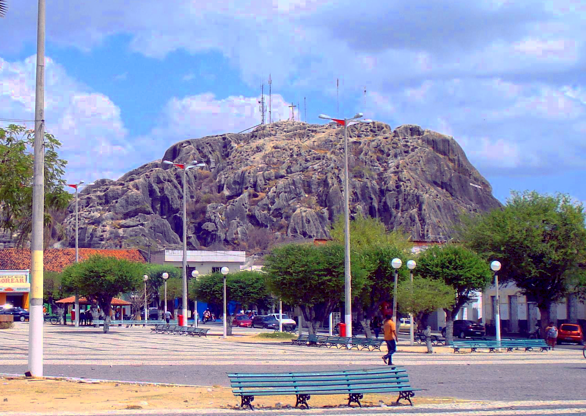

# Pedra do Cruzeiro

### Localização

Ela fica localizada no centro da cidade de Quixadá e é visível a partir de praticamente toda a cidade. É possível subir a pedra através de uma entrada que fica na Av. Plácido Castelo, próximo a igreja da Catedral.

### Sobre a Subida

Em média, a duração da súbida é cerca de 30 minutos. Ao chegar no topo é possível ver toda a cidade, uma das melhores vistas.

[Voltar a página inicial](README.md)